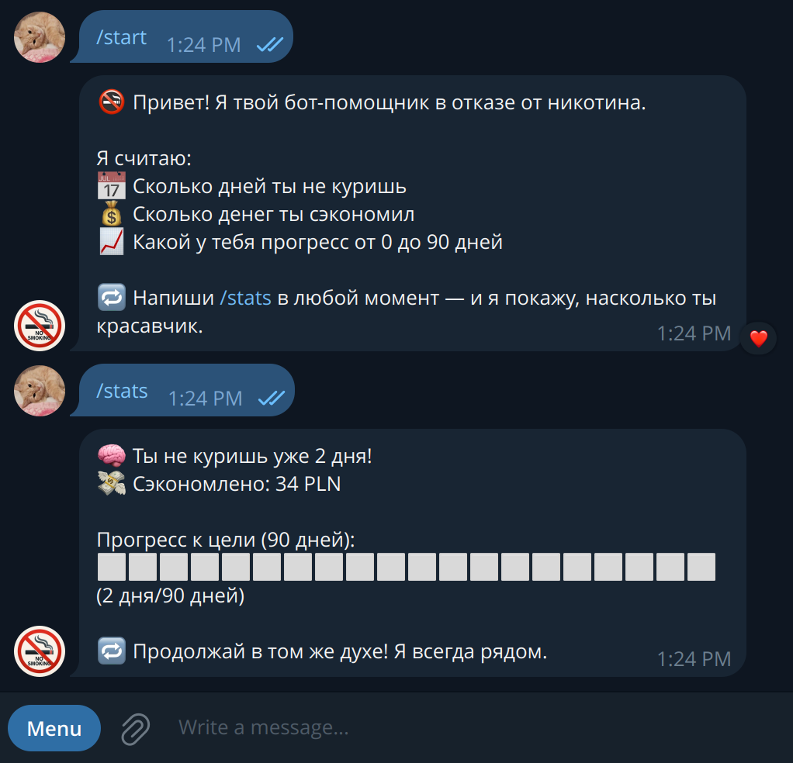

# 🚭 destructor_smoke_bot

**A Telegram bot to destroy your nicotine addiction.**  
Tracks smoke-free days, money saved, and your progress toward a 90-day goal.  
Minimal, motivating, and brutally effective.  
🧠 Built with [Aiogram 3](https://github.com/aiogram/aiogram) and Python.

---

## 📸 Screenshot



---

## ⚙️ Features

- 📅 Tracks the number of smoke-free days
- 💰 Calculates total money saved
- 📊 Shows a visual progress bar toward a 90-day milestone
- 🔘 Inline button for instant access to `/stats`
- 🧘‍♂️ Simple local logic — mongo database required

---

## 🚀 Quickstart

### 1. Clone the repo

```bash
git clone https://github.com/your-username/destructor_smoke_bot.git
cd destructor_smoke_bot
uv run app
```